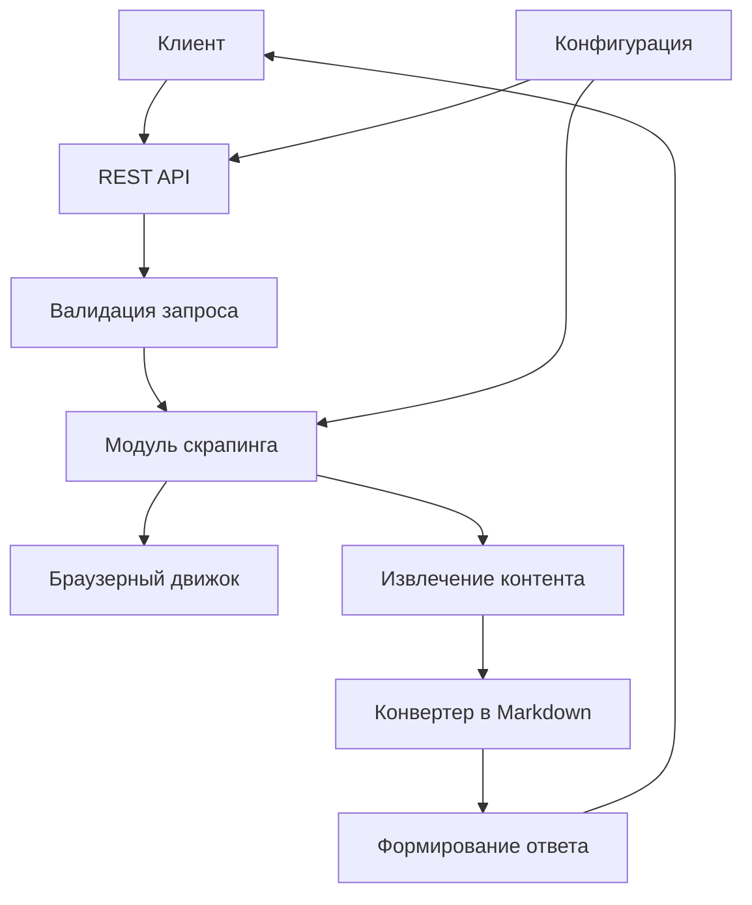

# Функциональный план микросервиса Page Scraper

## Технологический стек

Микросервис построен на основе следующих технологий:
- **NestJS** - фреймворк для создания эффективных и масштабируемых серверных приложений на Node.js
- **Fastify** - высокопроизводительный HTTP-сервер, используемый как платформа для NestJS
- **Crawlee** - библиотека для веб-скрапинга с поддержкой очередей и управления задачами
- **@extractus/article-extractor** - библиотека для извлечения основного контента статей с веб-страниц
- **Jest** - фреймворк для тестирования
- @ghostery/adblocker-playwright
- pino

## Назначение микросервиса

Микросервис Page Scraper предназначен для извлечения структурированных данных из веб-страниц по переданному URL. Основная задача сервиса — получить на вход URL и параметры скрапера, а вернуть JSON с основными данными страницы и статьёй в формате Markdown.

**Важно:** Сервис не хранит никаких данных, только временно хранит таски. Он только обрабатывает запросы и возвращает ответы. Для управления задачами используется встроенная очередь в Crawlee, которая позволяет выполнять несколько заданий одновременно.

## Архитектура микросервиса



## Основные функции

### 1. Скрапинг отдельных страниц
- Извлечение контента из HTML страниц
- Поддержка двух режимов скрапинга: Extractor (статический контент) и Playwright (динамический контент)
- Конфигурируемые параметры извлечения (таймауты, пользовательские агенты, локализация)
- Защита от антибот систем с использованием генерации отпечатков браузера

### 2. Пакетная обработка
- Обработка нескольких URL в одном запросе
- Управление задержками между запросами для имитации человеческого поведения
- Асинхронная обработка с уведомлением через вебхуки с настраиваемыми попытками повторной отправки

## API интерфейсы

### Базовый URL
`/{API_BASE_PATH}/v1`

### 1. Скрапинг отдельной страницы
**POST** `/page`

Извлекает данные с отдельной веб-страницы.

**Запрос:**
```json
{
  "url": "https://example.com/article",
  "mode": "extractor|playwright",
  "taskTimeoutSecs": 30,
  "blockTrackers": true,
  "blockHeavyResources": true,
  "fingerprint": {
    "generate": true,
    "userAgent": "auto",
    "locale": "en-US",
    "timezoneId": "UTC",
    "rotateOnAntiBot": true,
    "generator": {
      "browsers": ["chrome"]
    }
  }
}
```

**Ответ:**
```json
{
  "url": "https://example.com/article",
  "title": "Article title",
  "description": "Optional description",
  "date": "2024-11-12T10:00:00.000Z",
  "author": "John Doe",
  "body": "# Article title\n\nMarkdown content ...",
  "meta": {
    "lang": "en",
    "readTimeMin": 5
  }
}
```

### 2. Пакетная обработка
**POST** `/batch`

Обрабатывает несколько страниц с задержками и уведомлением по вебхуку.

**Запрос:**
```json
{
  "items": [
    { "url": "https://site1.com/a1", "mode": "playwright" },
    { "url": "https://site2.com/a2" }
  ],
  "commonSettings": {
    "mode": "extractor",
    "taskTimeoutSecs": 30,
    "blockTrackers": true,
    "blockHeavyResources": true,
    "fingerprint": {
      "generate": true,
      "userAgent": "auto",
      "locale": "en-US",
      "timezoneId": "UTC",
      "rotateOnAntiBot": true,
      "generator": {
        "browsers": ["chrome"]
      }
    }
  },
  "schedule": {
    "minDelayMs": 1500,
    "maxDelayMs": 4000,
    "jitter": true,
  },
  "webhook": {
    "url": "https://example.com/webhook",
    "headers": { "X-Source": "page-scraper", "Authorization": "Bearer <token>" },
    "backoffMs": 1000,
    "maxAttempts": 3
  }
}
```

**Ответ:**
```json
{ "jobId": "b-20241112-abcdef" }
```

**Данные, отправляемые в webhook по завершении задачи:**
```json
{
  "jobId": "b-20241112-abcdef",
  "status": "succeeded|failed",
  "createdAt": "2024-11-12T10:00:00.000Z",
  "completedAt": "2024-11-12T10:15:00.000Z",
  "total": 10,
  "processed": 10,
  "succeeded": 9,
  "failed": 1,
  "results": [
    {
      "url": "https://site1.com/a1",
      "status": "succeeded",
      "data": {
        "url": "https://site1.com/a1",
        "title": "Article title",
        "description": "Optional description",
        "date": "2024-11-12T10:00:00.000Z",
        "author": "John Doe",
        "body": "# Article title\n\nMarkdown content ...",
        "meta": {
          "lang": "en",
          "readTimeMin": 5
        }
      }
    },
    {
      "url": "https://site2.com/a2",
      "status": "failed",
      "error": {
        "code": 422,
        "message": "Failed to extract content from page",
        "details": "Page structure is not recognizable as an article"
      }
    }
  ]
}
```


### 3. Проверка состояния пакетной задачи
**GET** `/batch/:id`

Проверяет состояние выполнения пакетной задачи по её идентификатору.

**Ответ:**
```json
{
  "jobId": "b-20241112-abcdef",
  "status": "running|queued|succeeded|failed|partial",
  "createdAt": "2024-11-12T10:00:00.000Z",
  "total": 10,
  "processed": 4,
  "succeeded": 3,
  "failed": 1,
}
```

**Статусы задачи:**
- `queued` — задача поставлена в очередь и ожидает обработки
- `running` — задача выполняется в данный момент
- `succeeded` — задача успешно завершена
- `failed` — задача завершилась с ошибкой
- `partial` — задача завершилась с ошибкой, но часть данных успешно обработана

### 4. Проверка работоспособности
**GET** `/health`

Проверяет работоспособность микросервиса.

## Переменные окружения

### Основные настройки
- `NODE_ENV` — режим работы (`production|development|test`)
- `LISTEN_HOST` — хост для прослушивания (`0.0.0.0` или `localhost`)
- `LISTEN_PORT` — порт для прослушивания (по умолчанию `80`)
- `API_BASE_PATH` — префикс API (по умолчанию `api`)
- `LOG_LEVEL` — уровень логирования (`trace|debug|info|warn|error|fatal|silent`)
- `TZ` — часовой пояс (по умолчанию `UTC`)

### Настройки скрапера
- `DEFAULT_MODE` — режим скрапинга по умолчанию (`extractor|playwright`)
- `DEFAULT_TASK_TIMEOUT_SECS` — таймаут задачи по умолчанию в секундах (по умолчанию `60`)
- `DEFAULT_USER_AGENT` — пользовательский агент по умолчанию (`auto|yourString`)
- `DEFAULT_LOCALE` — локаль браузера для генерации отпечатка (например `en-US`, `ru-RU`)
- `DEFAULT_TIMEZONE_ID` — часовой пояс для отпечатка браузера и нормализации дат (например `UTC`). Примеры: Europe/Moscow (UTC+3), Europe/London (UTC+0/UTC+1), America/New_York (UTC-5/UTC-4), Europe/Berlin (UTC+1/UTC+2), America/Argentina/Buenos_Aires (UTC-3)

### Настройки браузера
- `PLAYWRIGHT_HEADLESS` — режим без графического интерфейса (`true|false`)
- `PLAYWRIGHT_NAVIGATION_TIMEOUT_SECS` — таймаут навигации в секундах
- `PLAYWRIGHT_BLOCK_TRACKERS` — блокировать трекеры (`true|false`)
- `PLAYWRIGHT_BLOCK_HEAVY_RESOURCES` — блокировать тяжёлые ресурсы (`true|false`)
- `FINGERPRINT_GENERATE` — генерировать отпечаток автоматически (`true|false`)
- `FINGERPRINT_ROTATE_ON_ANTI_BOT` — вращать отпечаток только после антибот-повтора (`true|false`)

### Настройки пакетной обработки
- `DEFAULT_BATCH_MIN_DELAY_MS` — минимальная задержка между запросами (по умолчанию `1500`)
- `DEFAULT_BATCH_MAX_DELAY_MS` — максимальная задержка между запросами (по умолчанию `4000`)
– `DATA_LIFETIME_MINS` — время хранения данных в памяти (минуты), минимум столько данные не удаляются (по умолчанию `60`)
– `CLEANUP_INTERVAL_MINS` — минимальный интервал между запусками процедуры очистки (по умолчанию `5`)

Примечание: конкурентность управляется глобально переменной `MAX_CONCURRENCY`. В глобальную конкурентность попадают задачи элементов из всех батчей; одновременно выполняются только `MAX_CONCURRENCY` задач независимо от батча.

### Настройки вебхуков
- `WEBHOOK_TIMEOUT_MS` — таймаут вебхука в миллисекундах (по умолчанию `10000`)
- `DEFAULT_WEBHOOK_BACKOFF_MS` — начальная задержка между попытками повтора вебхука в миллисекундах (по умолчанию `1000`, может быть переопределено в запросе)
- `DEFAULT_WEBHOOK_MAX_ATTEMPTS` — количество попыток повтора вебхука (по умолчанию `3`, может быть переопределено в запросе)


## Принцип работы микросервиса

### 1. Обработка запроса
1. Клиент отправляет POST-запрос на соответствующий эндпоинт
2. Сервис выполняет валидацию входных данных
3. Применяются настройки по умолчанию из переменных окружения
4. Запрос передаётся в модуль скрапинга

### 2. Процесс скрапинга
1. Выбор режима скрапинга (Extractor или Playwright) в соответствии с запросом
2. Инициализация движка с указанными параметрами и генерация отпечатка браузера (если требуется)
3. Загрузка страницы с учётом настроек блокировки ресурсов и трекеров
4. Извлечение контента с использованием алгоритмов анализа страницы
5. Конвертация HTML-контента в формат Markdown
6. Формирование структурированного ответа

### 3. Пакетная обработка
1. Создание задачи в очереди с уникальным идентификатором
2. Последовательная или параллельная обработка элементов с задержками
3. Агрегация результатов обработки
4. Отправка уведомления на вебхук с результатами с учётом настроек повторных попыток

### 4. Работа с антибот защитой
1. Генерация уникального отпечатка браузера на основе настроенных ограничений
2. Применение настроек блокировки трекеров и тяжёлых ресурсов
3. При обнаружении антибот защиты - автоматическое вращение отпечатка (если включено)
4. Повторная попытка скрапинга с новым отпечатком браузера

## Типы данных

### Извлекаемые поля
- `title` — заголовок страницы/статьи
- `description` — описание или анонс
- `date` — дата публикации
- `author` — автор контента
- `body` — основное содержимое в формате Markdown
- `link` — URL страницы (для списков)
- `tags` — массив тегов или категорий

**Важное замечание:** На начальном этапе разработки микросервис не собирает изображения с веб-страниц. В будущем планируется добавить функциональность для получения главной картинки статьи.

Теги: массив уникальных, очищенных тегов в нижнем регистре, готовых для хранения и использования. Например, ["AI", "Fin-Tech ", "<b>новости</b>", "ai"] превратится в ["ai", "fin tech", "новости"].

### Метаданные
- `lang` — язык страницы
- `readTimeMin` — примерное время чтения в минутах
- `total` — общее количество элементов
- `limit` — ограничение на количество элементов
- `scrapedAt` — время выполнения скрапинга

## Обработка ошибок

### Коды ошибок
- `400` — ошибка валидации входных данных
- `422` — не удалось извлечь контент со страницы
- `504` — таймаут загрузки страницы
- `502` — ошибка браузерного движка
- `500` — внутренняя ошибка сервера

### Формат ответа с ошибкой
```json
{
  "error": {
    "code": 422,
    "message": "Failed to extract content from page",
    "details": "Page structure is not recognizable as an article"
  }
}
```

## Ограничения и безопасность

### Ограничения
- Ограничение на размер ответа
- Таймауты выполнения запросов
- Ограничение на количество одновременных сессий

## Мониторинг и логирование

### Логирование
- Структурированные логи в формате JSON с использованием pino
- Уровни логирования в соответствии с переменной окружения
- Контекстная информация для каждого запроса
- Логирование ключевых этапов обработки

## Очистка

Очистка реализована как внутренняя in-memory процедура (без внешнего планировщика и без записи на диск) с учётом следующих правил:

- После каждого запроса `POST /page` и `POST /batch` очистка запускается параллельно с основной обработкой запроса.
- Запрос завершается только после завершения как основной обработки, так и очистки.
- Очистка не запускается, если предыдущая ещё выполняется (встроенная блокировка), и не запускается чаще, чем `CLEANUP_INTERVAL_MINS`.
- Удаляются только те записи (результаты и состояния задач), чей возраст строго больше `DATA_LIFETIME_MINS`. Все более «молодые» записи пропускаются.
- После удаления по TTL никаких данных не остаётся в памяти — как будто их никогда не было.