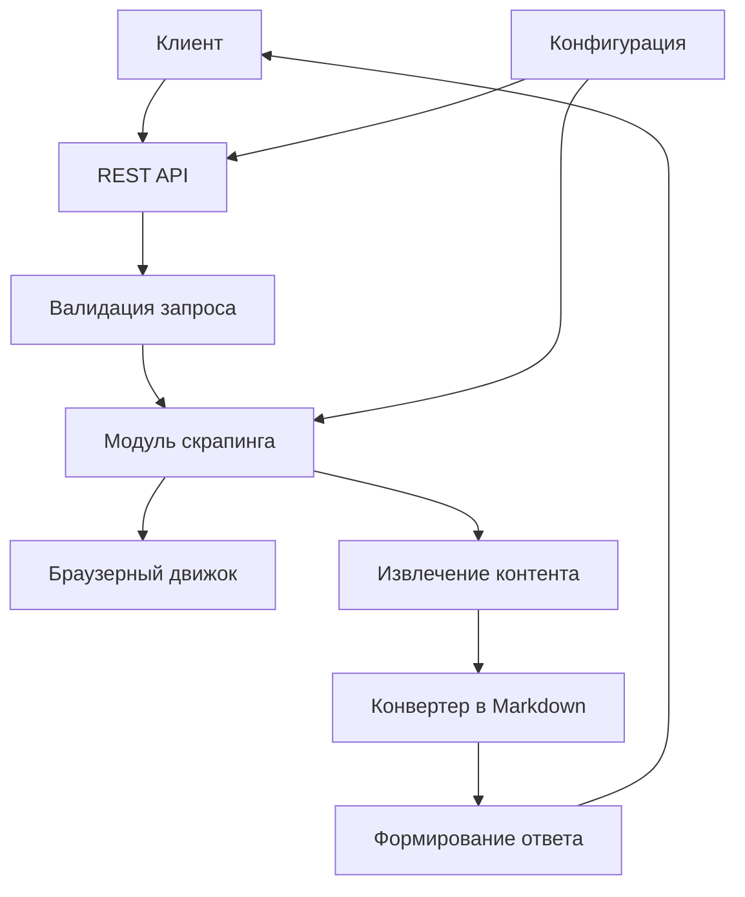

# Функциональный план микросервиса Page Scraper

## Назначение микросервиса

Микросервис Page Scraper предназначен для извлечения структурированных данных из веб-страниц по переданному URL. Основная задача сервиса — получить на вход URL и параметры скрапера, а вернуть JSON с основными данными страницы и статьёй в формате Markdown.

## Архитектура микросервиса



## Основные функции

### 1. Скрапинг отдельных страниц
- Извлечение контента с произвольных URL по запросу
- Поддержка различных режимов рендеринга (статический и динамический контент)
- Конфигурируемые параметры извлечения (селекторы, таймауты, пользовательские агенты)

### 2. Пакетная обработка
- Обработка нескольких URL в одном запросе
- Управление задержками между запросами для имитации человеческого поведения
- Асинхронная обработка с уведомлением через вебхуки

### 3. Работа с преднастроенными источниками
- Использование конфигурационных файлов для описания правил извлечения
- Поддержка различных типов источников (новостные ленты, отдельные статьи)
- Переиспользование настроек для однотипных страниц

## API интерфейсы

### Базовый URL
`/{API_BASE_PATH}/v1`

### 1. Скрапинг отдельной страницы
**POST** `/page`

Извлекает данные с отдельной веб-страницы.

**Запрос:**
```json
{
  "url": "https://example.com/article",
  "options": {
    "render": true,
    "waitUntil": "domcontentloaded",
    "timeoutMs": 30000,
    "locale": "en-US",
    "timezone": "UTC",
    "userAgent": "auto|desktop|mobile|custom-string",
    "removeSelectors": ["nav", "footer", ".ads"],
    "overrideSelectors": {
      "title": "",
      "description": "",
      "author": "",
      "date": "",
      "content": ""
    }
  }
}
```

**Ответ:**
```json
{
  "url": "https://example.com/article",
  "title": "Article title",
  "description": "Optional description",
  "date": "2024-11-12T10:00:00.000Z",
  "author": "John Doe",
  "body": "# Article title\n\nMarkdown content ...",
  "meta": {
    "lang": "en",
    "readTimeMin": 5
  }
}
```

### 2. Пакетная обработка
**POST** `/batch`

Обрабатывает несколько страниц с задержками и уведомлением по вебхуку.

**Запрос:**
```json
{
  "items": [
    { "url": "https://site1.com/a1", "options": { "render": true } },
    { "url": "https://site2.com/a2" }
  ],
  "commonOptions": {
    "render": true,
    "waitUntil": "domcontentloaded",
    "timeoutMs": 30000
  },
  "schedule": {
    "minDelayMs": 1500,
    "maxDelayMs": 4000,
    "jitter": true,
    "concurrency": 1
  },
  "webhook": {
    "url": "https://example.com/webhook",
    "headers": { "X-Source": "page-scraper" }
  }
}
```

**Ответ:**
```json
{ "jobId": "b-20241112-abcdef" }
```

### 3. Работа с преднастроенными источниками
**POST** `/sources/:sourceId`

Выполняет скрапинг по преднастроенным правилам из конфигурации.

**Запрос:** без тела (опционально можно передать параметры переопределения)

**Ответ:**
```json
{
  "sourceId": "example_news",
  "type": "news_page",
  "items": [
    {
      "title": "News title 1",
      "description": "News description",
      "date": "2024-11-12T10:00:00.000Z",
      "link": "https://example.com/news/1",
      "tags": ["politics", "economy"]
    }
  ],
  "meta": {
    "total": 1,
    "limit": 100,
    "scrapedAt": "2024-11-12T12:00:00.000Z"
  }
}
```

### 4. Проверка состояния
**GET** `/health`

Проверяет работоспособность микросервиса.

## Переменные окружения

### Основные настройки
- `NODE_ENV` — режим работы (`production|development|test`)
- `LISTEN_HOST` — хост для прослушивания (`0.0.0.0` или `localhost`)
- `LISTEN_PORT` — порт для прослушивания (по умолчанию `80`)
- `API_BASE_PATH` — префикс API (по умолчанию `api`)
- `LOG_LEVEL` — уровень логирования (`trace|debug|info|warn|error|fatal|silent`)
- `TZ` — часовой пояс (по умолчанию `UTC`)

### Настройки скрапера
- `SCRAPER_DEFAULT_RENDER` — режим рендеринга по умолчанию (`true|false`)
- `SCRAPER_DEFAULT_TIMEOUT_MS` — таймаут по умолчанию в миллисекундах (по умолчанию `30000`)
- `SCRAPER_DEFAULT_USER_AGENT` — пользовательский агент по умолчанию (`auto|desktop|mobile`)
- `SCRAPER_DEFAULT_LOCALE` — локаль по умолчанию (например `en-US`)
- `SCRAPER_DEFAULT_TIMEZONE` — часовой пояс по умолчанию (например `UTC`)

### Настройки браузера
- `PLAYWRIGHT_HEADLESS` — режим без графического интерфейса (`true|false`)
- `PLAYWRIGHT_TIMEOUT_MS` — таймаут браузера в миллисекундах
- `PLAYWRIGHT_BLOCK_TRACKERS` — блокировать трекеры (`true|false`)
- `PLAYWRIGHT_BLOCK_HEAVY_RESOURCES` — блокировать тяжёлые ресурсы (`true|false`)

### Настройки пакетной обработки
- `BATCH_MIN_DELAY_MS` — минимальная задержка между запросами (по умолчанию `1500`)
- `BATCH_MAX_DELAY_MS` — максимальная задержка между запросами (по умолчанию `4000`)
- `BATCH_CONCURRENCY` — количество одновременных запросов (по умолчанию `1`)
- `BATCH_MAX_ITEMS` — максимальное количество элементов в пакете

### Настройки вебхуков
- `WEBHOOK_TIMEOUT_MS` — таймаут вебхука в миллисекундах (по умолчанию `10000`)
- `WEBHOOK_RETRY_ATTEMPTS` — количество попыток повтора вебхука (по умолчанию `3`)

### Настройки конфигурации
- `CONFIG_PATH` — путь к файлу конфигурации источников (по умолчанию `./config.yaml`)

## Принцип работы микросервиса

### 1. Обработка запроса
1. Клиент отправляет POST-запрос на соответствующий эндпоинт
2. Сервис выполняет валидацию входных данных
3. Применяются настройки по умолчанию из переменных окружения
4. Запрос передаётся в модуль скрапинга

### 2. Процесс скрапинга
1. Инициализация браузерного движка с указанными параметрами
2. Загрузка страницы с учётом настроек рендеринга и ожидания
3. Применение селекторов для удаления нежелательных элементов
4. Извлечение контента с использованием алгоритмов анализа страницы
5. Конвертация HTML-контента в формат Markdown
6. Формирование структурированного ответа

### 3. Пакетная обработка
1. Создание задачи в очереди с уникальным идентификатором
2. Последовательная или параллельная обработка элементов с задержками
3. Агрегация результатов обработки
4. Отправка уведомления на вебхук с результатами

### 4. Работа с конфигурацией источников
1. Загрузка конфигурации из файла `config.yaml`
2. Применение правил извлечения для указанного источника
3. Итерация по элементам страницы в соответствии с селекторами
4. Формирование массива структурированных данных

## Типы данных

### Извлекаемые поля
- `title` — заголовок страницы/статьи
- `description` — описание или анонс
- `date` — дата публикации
- `author` — автор контента
- `body` — основное содержимое в формате Markdown
- `link` — URL страницы (для списков)
- `tags` — массив тегов или категорий

### Метаданные
- `lang` — язык страницы
- `readTimeMin` — примерное время чтения в минутах
- `total` — общее количество элементов
- `limit` — ограничение на количество элементов
- `scrapedAt` — время выполнения скрапинга

## Обработка ошибок

### Коды ошибок
- `400` — ошибка валидации входных данных
- `404` — источник не найден (для преднастроенных источников)
- `422` — не удалось извлечь контент со страницы
- `504` — таймаут загрузки страницы
- `502` — ошибка браузерного движка
- `500` — внутренняя ошибка сервера

### Формат ответа с ошибкой
```json
{
  "error": {
    "code": 422,
    "message": "Failed to extract content from the page",
    "details": "Page structure is not recognizable as an article"
  }
}
```

## Ограничения и безопасность

### Ограничения
- Максимальное количество URL в одном пакетном запросе
- Ограничение на размер ответа
- Таймауты выполнения запросов
- Ограничение на количество одновременных сессий

### Безопасность
- Валидация URL для предотвращения SSRF-атак
- Блокировка локальных адресов и схем `file://`
- Очистка пользовательского ввода
- Настройка CSP и других заголовков безопасности

## Мониторинг и логирование

### Логирование
- Структурированные логи в формате JSON
- Уровни логирования в соответствии с переменной окружения
- Контекстная информация для каждого запроса
- Логирование ключевых этапов обработки

### Метрики
- Количество обработанных запросов
- Время обработки запросов
- Уровень ошибок
- Использование ресурсов